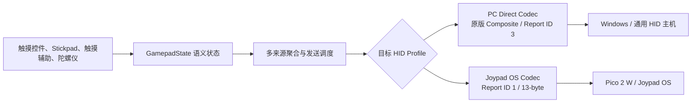

# Bluke Gamepad Edition：项目介绍与开发复盘

> 一款以原版 Bluke 为基础、面向触屏手柄操作、Windows 蓝牙直连与 Joypad OS 桥接场景的个人增强版本。

## 文档说明

- 本文依据 13 个指定的 Codex 开发任务、当前仓库的 Git 历史、路线文档、测试记录与构建产物整理。
- “Bluke Gamepad Edition”是本文对整个增强项目的统称；早期的 `GamePadOnly`、路线一的 `OriginalEnhanced` 和路线二的双 HID Profile，是项目不同阶段，不应混为同一个完成状态。
- 本项目建立在原版 Bluke 的蓝牙 HID 能力之上。它是个人增强分支，不代表 Bluke 上游官方版本。
- 文中严格区分“已实现”“自动化验证通过”和“用户实机验证通过”。失败后已经回退的实验不会被写成最终功能，自动化故障路径也不会冒充用户做过相同实机故障注入。
- 文档核验日期：2026-08-16。当前仓库分支为 `codex/route2-dual-hid-profile`，`HEAD` 为 `a6ca462`，标签为 `v4`。这里的 `v3`、`v4`只是 Git 检查点名称，不是布局文件格式名；其中 `v4` 已由用户完成路线二最终实机验收，但尚未另建 release-candidate 标签。
- 本文完成后已在当前 `HEAD` 重新运行 `testDebugUnitTest` 与 `assembleDebug`，两者均为 `BUILD SUCCESSFUL`。

## 快速了解

| 问题 | 结论 |
|---|---|
| 它从哪里来？ | 从原版 Bluke 的 Android 蓝牙键盘、触控板和通用 HID 手柄能力发展而来。 |
| 为什么要做？ | 原版手柄可直连 Windows，却无法被 iOS/iPadOS 稳定识别为游戏控制器；同时原版手柄界面和操控能力较基础。 |
| 最初怎样绕过 iOS 限制？ | 让手机把输入发给刷入 Joypad OS 的 Pico 2 W，再由 Pico 以主机支持的控制器协议输出。 |
| 在 Bluke 上增加了什么？ | 可编辑多实例手柄布局、Stickpad、触摸辅助、陀螺仪双模式、布局导入导出、双 HID Profile、125/250/500 Hz 输出管线、诊断与自动测试工具等。 |
| Windows 直连是否完成？ | 路线一已经通过 Windows `joy.cpl`、Steam Input 和实际游戏验证。 |
| Joypad 与 PC 能否共存在一个 APK？ | 可以。路线二已完成双 Profile 架构、完整实机矩阵、两套 30 分钟稳定性与断开/切换清理验收。 |
| Android 直连 iOS 是否解决？ | 没有。多轮尝试表明，普通 Android 应用无法仅靠 Generic Classic HID 描述符可靠模拟受 iOS 接纳的 Xbox/PlayStation 控制器。 |
| 500 Hz 是否等于主机收到 500 个新状态？ | 不等于。它是手机端名义调度上限；实测瓶颈主要位于 Android 蓝牙栈、链路、Pico USB 或 Windows HID 队列。 |

## 一、我的动机

### 1. 原版 Bluke 给了我一个很好的起点

原版 Bluke 已经能让 Android 手机充当蓝牙 HID 设备，并提供三种实用模式：

- 蓝牙键盘；
- 蓝牙触控板/鼠标；
- 通用蓝牙 HID 手柄。

它的价值在于不要求电脑安装专用接收客户端。对 Windows 11 这类兼容性较宽松的主机，手机可以直接连接并发送输入。因此，我并不是要重新做一个蓝牙 HID 应用，而是希望保留 Bluke 成熟的连接、键盘、触控板和模式切换基础，把手柄部分发展成真正适合日常使用的版本。

### 2. 直接连接 iPhone/iPad 的失败，是项目真正的起点

我的最初目标之一，是让 Android 手机直接通过蓝牙连接 iOS/iPadOS，并模拟成手柄。实际现象却是：

- 同一套 Bluke 在 Windows 11 上可以使用；
- iPadOS 有时可以完成配对，却不把它当作可用游戏控制器；
- 旧复合描述符被错误缓存时，键盘按键甚至会被解释成鼠标向下移动，不同键码对应不同移动距离；
- 切换键盘、触控板、手柄 Profile 经常要求删除配对、重开蓝牙，严重时应用重启也无法恢复；
- 即使把手柄报告改得更“标准”，iOS 手柄模式仍然没有真正可用。

这说明“蓝牙已配对”和“系统已将设备注册成游戏控制器”是两件不同的事。Bluke 通过了前一层，却无法可靠通过 iOS 的控制器识别层。

### 3. 我转向了 Pico 2 W + Joypad OS 桥接

直连路线迟迟走不通后，我换了思路：

```text
Android 手机上的 Bluke
        ↓  Classic Bluetooth HID
刷入 Joypad OS 的 Pico 2 W
        ↓  Joypad 解析、标准化并重新输出
iOS/iPadOS、Windows 或其他主机
```

这个方案成功的关键，不是 Pico 简单转发了 Bluke 的原始报告，而是 Joypad OS 能宽松解析 Generic HID 输入，再以主机已经支持的控制器身份和协议输出。以 USB XInput 路径为例，Pico 可以呈现为 Xbox 360 控制器，而普通 Android 应用没有公开 API 可以完整设置相同的 VID/PID、传输语义和设备协议。

### 4. 桥接成功后，又暴露出新的限制

为了让 Joypad OS 正确识别 Bluke，我最初做出了 `GamePadOnly`：移除键盘和触控板，只注册一个纯手柄 Profile，并按照 Joypad 的解析需求重写报告。

它解决了连接和映射问题，却带来两个明显代价：

1. 键盘、触控板和原版三模式切换被牺牲了；
2. Joypad 专用的描述符、13 字节报告和按钮顺序，不适合直接作为 Windows 通用 HID 的替代品。

与此同时，我已经在这个纯手柄原型上加入了大量界面和操控增强。如果这些能力只能通过 Pico 使用，那么对 Windows 11 这种本来就能直连 Bluke 的设备并不理想。

### 5. 最终目标：保留原版，同时拥有增强手柄和两条连接路径

因此，项目目标逐渐清晰：

- 以原版 Bluke 为基础，而不是继续把应用做成 Joypad 专用版；
- 保留原版 `BluetoothKeyboardManager` 的键盘、触控板、手柄和模式切换行为；
- 把已经成熟的增强手柄 UI、布局、触摸和陀螺仪能力迁回原版；
- Windows 等兼容主机继续使用原版 PC Direct Profile；
- Pico/Joypad 使用独立的 Joypad OS Profile；
- 两个 Profile 共享同一套“手柄语义状态”，但使用各自严格隔离的描述符、报告编码和发送策略。

这就是 Bluke Gamepad Edition 的核心动机：**不是把手机伪装成某一款实体手柄，而是把 Bluke 发展成一个可编辑、可测量、可按目标主机选择输出协议的触屏手柄平台。**

## 二、项目目标与边界

### 1. 主要目标

- 保留原版 Bluke 的 Keyboard、Touchpad、Gamepad 三模式和原有蓝牙行为。
- 为 Gamepad 页面提供适合触屏操作的可编辑布局系统。
- 同时支持 PC Direct 和 Joypad OS 两套输出 Profile。
- 保证两个 Profile 的描述符、Report ID、报告长度、按钮映射与发送策略互不污染。
- 解决 Joypad 场景下“摇杆同时使用时按键跟手、单独按键却迟钝”的问题。
- 支持陀螺仪映射、区域摇杆、多实例控件、触摸辅助等增强能力。
- 建立自动化测试、真实主机测量工具、Git 检查点和分阶段验收流程。

### 2. 明确不做的事

- 不把 Joypad OS 专用的 HID 描述符、13 字节报告和按钮映射直接覆盖到 PC Direct。
- 不把通用 HID 宣称为原生 XInput；需要 XInput 的场景仍依赖 Steam Input、Joypad 桥接或其他适配层。
- 不伪造“只改设备名就能变成 Xbox/PlayStation 手柄”的结论。
- 不把名义 500 Hz 写成主机端已经稳定获得 500 Hz 新鲜状态。
- 不在路线二未完成实机矩阵前宣称双 Profile 已达到最终发布状态。
- 不提前修改 Joypad OS 来掩盖 Bluke 端尚未解决的问题；当前路线坚持先在 Bluke 内完成两套隔离输出。

## 三、从失败到可用版本：开发历程

### 阶段 0：尝试让原版 Bluke 直连 iOS/iPadOS

这是持续时间最长、失败分支最多的一轮探索。先后尝试过：

1. 在主页增加 `Make Bluke Discoverable`，让 iOS 主动发现 Android；实测证明主动/被动发现不是根因，功能随后回退。
2. 补充 HID 控制通道处理，包括 `GET_REPORT`、`SET_PROTOCOL`、Boot Protocol、`sendReport` 返回值和 virtual cable 日志。
3. 把 `Device-Controlled` 改成按当前页面注册 Keyboard-only、Mouse-only 或 Gamepad-only Profile。
4. 为了尊重原版语义，又恢复 `Device-Controlled`，新增独立的 iOS Compatibility 模式。
5. 尝试运行时注销并重注册不同 Profile，加入断开、等待、反射调用 `virtualUnplug/unplug` 等“干净切换”流程。
6. 尝试固定 iOS Composite Profile，避免每次切换页面都重注册。
7. 尝试完全独立的 iOS 设备类型设置，要求每次改变类型后双端删除配对并重启。
8. 将手柄描述符调整为更常见的 Game Pad、Hat、`X/Y/Rx/Ry`、`Z/Rz` 结构，并将摇杆改为 16 位、报告改为 13 字节。

这些版本有时改善了键盘或触控板，有时却导致所有模式失效、只有键盘可用，或者 Profile 与 UI 不一致。最终代码与资料审计确认：普通 Android 应用通过 `BluetoothHidDeviceAppSdpSettings` 可以设置名称、描述、Provider、Subclass 和 Report Descriptor，却不能完整复刻 Xbox/PlayStation 所需的设备身份与协议；iOS 也没有公开“任意 Classic HIDP Gamepad 一定会成为 `GCController`”的匹配规则。

最终结论是：继续微调 Generic HID 报告的收益很低。该路线被停止，Pico/Joypad 桥接成为现实可行方案。

### 阶段 1：建立 Joypad 专用的 GamePadOnly 原型

为了验证 Android → Pico 的链路，项目首先去掉复合 HID：

- 只保留 Gamepad collection；
- SDP 改为 `Bluke Gamepad / Generic Bluetooth HID Gamepad`；
- Subclass 改为 `SUBCLASS2_GAMEPAD`；
- Class of Device 改为手柄类型；
- 首页和应用内模式暂时固定为 Gamepad；
- 键盘和鼠标发送入口停止实际发包。

第一版虽然可以连接，但按钮和 D-pad 映射仍有明显错位。随后报告被重写为 Joypad 需要的 13 字节结构：

```text
buttons(2) + hat(1) + X/Y/Rx/Ry(8) + LT/RT(2)
```

具体变化包括：

- D-pad 从普通按钮改为 Hat switch；
- LT/RT 从普通按钮改为 0/255 触发值；
- 四个摇杆轴采用 16 位小端；
- ABXY、肩键、View/Menu、L3/R3、Guide/Share 压入 16 个按钮位；
- 根据 Joypad Input Test 的实测，数次修正 L3/R3、View/Menu、Guide 等错位顺序。

这一步终于让 Bluke 与 Pico/Joypad 的连接和主要映射可用。

### 阶段 2：解决 Joypad 单独按键不跟手

实际测试出现了一个很有价值的现象：

- 单独移动摇杆时很跟手；
- 移动摇杆的同时按按钮也很跟手；
- 完全不碰摇杆、只按按钮时明显迟钝。

代码审计发现，Joypad 并没有显式设置“摇杆高回报率、按钮低回报率”。真正差异在于事件密度：摇杆持续变化会产生连续报告，按钮通常只有按下和松开两个状态，Pico 的 USB 输出层在没有新事件时不会持续刷新。

最终在 Bluke 端加入按键 burst：

- 数字按钮或 D-pad 变化时立即发送完整状态；
- 之后 140 ms 内每 8 ms 重发当前完整报告；
- 摇杆和陀螺仪仍走正常合帧，不人为制造摇杆微抖动；
- 不改 Joypad 的按钮映射和 HID 描述符。

用户实测确认“按键不跟手”问题解决。这个经验后来被保留为 Joypad Profile 专用发送策略，而没有无条件施加到 PC Direct。

### 阶段 3：在纯手柄原型上发展增强 UI

连接可用后，工作重点转向“把手机屏幕真正变成好用的手柄”。这一阶段形成了大部分 Gamepad Edition 的交互能力：

- L3/R3 从摇杆中拆出，成为可独立摆放的按钮；
- 支持 Xbox 与 PlayStation 风格控件和布局；
- 建立多布局管理、JSON 导入导出和内置布局；
- 建立多实例控件、撤销/重做、删除、缩放和对齐参考线；
- 增加独立方向键、独立面键、Stickpad、触摸辅助和陀螺仪；
- 改善肩键尺寸、D-pad 形状、选中态、菜单和设置页。

这一阶段也经历了大量 UI 回归和交互方向修正，详见“失败的尝试与得到的经验”。

### 阶段 4：路线一——把增强手柄迁回原版 Bluke

纯手柄原型证明了增强功能的价值，但它不应成为唯一产品形态。路线一建立了一个干净工作区：

- `reference/Bluke-mainOriginal`：原版只读参考；
- `reference/Bluke-mainGamePadOnly`：增强纯手柄只读参考；
- `work/Bluke-mainOriginalEnhanced`：唯一目标工程；
- `docs`：规划、映射和验收记录。

迁移遵循“Original 为基础、增强能力按阶段移入”的原则：

1. 建立原版基线提交 `a1148b5`，标签 `route1-original-baseline`。
2. 第一阶段只迁移增强 `GamepadView`、陀螺仪映射、PS5 Stickpad 资源和必要权限；原版蓝牙管理器、首页、键盘、触控板和 Gradle 配置保持不动。
3. 第二阶段只补回屏幕方向持久化，同时确认三模式切换不被 Gamepad 页面写死。
4. 第三阶段迁移三个增强专项单元测试。
5. 第四阶段完成原版功能回归。
6. 第五阶段在 Windows `joy.cpl` 逐项记录真实映射。
7. 第六阶段完成 Steam、Steam Input、实际 Windows 游戏、长时间运行、后台恢复与蓝牙重连验收。

路线一最终提交为 `39b028a`，标签为 `route1-direct-gamepad-working`。它证明了一件核心事情：**无需使用 Joypad 专用描述符，也可以把增强手柄 UI 放回原版 Bluke，并在 Windows 11 上保持可用的 PC Direct 路径。**

### 阶段 5：路线二——一个 APK 中隔离 Joypad 与 PC Direct

路线二从路线一最终标签开始，目标不是把两个描述符揉在一起，而是共享输入语义、隔离输出协议。



第一轮加入 16 个 Kotlin 文件，建立：

- `GamepadState` 语义模型；
- 多来源聚合器；
- `PcDirectCodec` 与 `JoypadOsCodec`；
- Profile 注册表、描述符和发送策略；
- 原有 bitmask 到语义状态的兼容适配器；
- 两套 golden report tests。

这轮只抽象代码，不切换运行时路径，目的是证明 Joypad 报告字节不变。提交为 `cb22b31`，当时全套 59 项测试通过。

第二轮加入可测试的 HID 注册状态机：

- `Unregistered`、`Registering`、`Ready`、`Connecting`、`Connected`、`Unregistering`、`Failed`；
- 用互斥锁串行化 disconnect、unregister、register、connect；
- 以异步回调而不是 API 返回值作为完成依据；
- 为每个蓝牙 MAC 保存目标 Profile；
- Joypad Profile 只允许 Gamepad，PC Direct 保留 Keyboard/Touchpad/Gamepad；
- 切换时重建对应 SDP、Descriptor、Codec 和传输策略。

这轮提交为 `c800b41`，当时全套 89 项测试通过。

首次实机测试暴露了两个严重问题：

1. UI 显示了手动选择，但旧的每设备保存值在连接时又静默覆盖选择，导致实际注册的仍是旧 Profile；
2. PC 键盘断开时只清了应用内状态，没有先发全零键盘报告，Windows 会继续保持旧按键，直到下一次键盘输入。

修复后，Profile 切换变成明确事务，失败可以回滚；断开和切换前会依次尝试发送键盘 neutral、鼠标 neutral、手柄 neutral，再清理所有本地输入、burst 与会话状态。对应提交为 `1247cd1`，当时全套 99 项测试通过。

连接方式 UI 也经过简化：最初放在首页的大卡片被认为重复且低效，后来改为 PC Direct 默认、首次进入 Gamepad 时询问目标类型，并提示长按当前连接设备标签修改；只有 Joypad 设备显示 Joypad 标识。

### 阶段 6：250/500 Hz、测试工具与后续打磨

在双 Profile 基础上，项目加入 125、250、500 Hz 三档目标回报率：

- 125 Hz：保留原版 8 ms 协程、普通队列和事件驱动行为；
- 250 Hz：4 ms 增强管线；
- 500 Hz：2 ms 增强管线，作为实验档保留。

增强管线不靠重复灌入相同模拟量来制造数字：

- 模拟量使用 latest-wins 单槽，只保留最新状态；
- 数字按钮和 D-pad 使用有序边沿队列；
- 数字边沿可紧急唤醒发送线程；
- 20 ms 无输入时发送 keepalive；
- Joypad 的 140 ms 数字 burst 保留；
- 发送线程使用固定周期和过期重定相，避免迟到后追发造成“长间隔 + 短间隔”成对出现；
- 增加动态 outgoing QoS 和 `BlukeRate` 分层计数。

随后又加入自动时间轴测试、Windows Raw Input/XInput 采集工具、报告生成、相位新鲜度和批量到达分析。性能优化之后，工作重点从“追求手机调用次数”转向“主机最终看到的新鲜状态和尾部延迟”。

最终，用户使用 Xiaomi 15 Pro 和当前最新提交 `a6ca462`（`v4`）完成 Pico/Joypad 全映射、Windows `joy.cpl` 对照、PC Keyboard/Touchpad 回归、双 Profile 增强功能矩阵、Profile 来回切换、每设备绑定恢复、两套各 30 分钟稳定性以及断开/切换后的状态清理。路线二由“已经实现、等待实机验收”转为“最终实机验收通过”。

## 四、在 Bluke 基础上具体做了什么

### 1. 保留并扩展原版能力

路线一没有替换原版 Bluke 的整体架构，而是保留：

- 原版 `BluetoothKeyboardManager`；
- Keyboard、Touchpad、Gamepad 三种页面；
- 原有模式切换和首页逻辑；
- PC Direct 的 Composite HID descriptor；
- Keyboard LED/锁键回调；
- 原版 Gradle/AGP 基线。

增强内容主要集中在 Gamepad 页面，并在路线二通过语义状态层接入两套输出协议。这种做法既保留了上游功能，也避免把 Joypad 原型的专用协议强行覆盖到原版。

### 2. 双 HID Profile 与语义状态层

两套 Profile 的核心差异如下：

| 项目 | PC Direct | Joypad OS |
|---|---|---|
| 目标 | Windows / 通用 HID 主机 | Pico 2 W / Joypad OS |
| SDP/Descriptor | 原版 Composite HID | 纯 Gamepad HID |
| 页面 | Keyboard、Touchpad、Gamepad | 只允许 Gamepad |
| Gamepad Report ID | 3 | 1 |
| Gamepad payload | 11 字节 | 13 字节 |
| 按钮 | 原版 18 Button 映射 | 16 Button，其中 15 可用、1 保留 |
| D-pad | Button 13–16 | Hat 0–7，Neutral 8 |
| LT/RT | 数字 Button 7/8 | 数字按钮 + 0/255 trigger 字节 |
| 摇杆 | 原版 X/Y/Z/Rx | 四个 16 位小端轴 |
| 数字 burst | 不使用 Joypad 140 ms burst | 使用 140 ms burst |
| 键盘 LED | 保留原版解码 | 不把输出报告误当键盘 LED |

`GamepadState` 只描述“用户现在按了什么、摇杆在哪里”，不包含任何主机专用字节布局。Codec 决定如何编码，Transmission Policy 决定何时发送。这是整个项目从“堆叠功能”走向“可维护双协议”的关键重构。

### 3. 可编辑、多布局、多实例的手柄界面

布局系统从原先保存在偏好设置中的单一布局，发展为可管理的 JSON 布局集合：

- Xbox 与 PlayStation 两种视觉体系；
- 多个自定义布局；
- 新建、重命名、复制、删除、排序、导入、导出；
- 默认布局锁定，但允许复制后编辑；
- 未保存修改采用二次操作确认，避免误切换丢失；
- 编辑模式支持最多 50 步撤销/重做；
- 控件具有稳定实例 ID 和稳定顺序；
- 14 类主要控件可拥有多个实例，每类最多 8 个；
- 删除按钮遵循“后添加的先删除，最后才删除初始实例”；
- 可在画布上直接选中、移动、缩放和删除控件；
- 删除与缩放手柄固定为 22 dp，不随控件缩放而变小；
- 缩放手柄图标旋转 90°，使图形方向与实际拖动方向一致；
- LB/LT/RB/RT 支持宽高独立调整，范围扩展到 0.25–4.0；
- 摇杆、Stickpad、肩键和特殊按钮分别使用适合自身的缩放逻辑。

控件列表最终采用四列紧凑网格，L/R 等短标签缩小到合适比例，ABXY/PlayStation 符号使用 Canvas 居中绘制。空白模板条目并没有从数据模型中删除，只是在用户列表中隐藏，仍可作为后续页面复用的结构基础。选中项采用白色背景与灰色图标的反相视觉，和未选中项形成稳定区分。

当布局管理、功能设置等入口全部迁入菜单后，旧的顶部控制条被移除，编辑画布上边距随之缩小，内置布局重新居中。菜单宽度、最大高度、底部定位、滚动区域和渐隐提示会根据屏幕尺寸调整，而不是依赖单一分辨率。

布局编辑器还提供三类参考线：

- 黄色：控件边缘对齐；
- 红色：屏幕中心线；
- 绿色：镜像位置。

最终行为是“显示 1 dp 范围内的参考线，但不自动吸附”。也就是说，参考线帮助精确摆放，系统不再偷偷修正坐标。

### 4. 内置布局与布局兼容

- 内置 PS5 Stickpad 布局；
- 后续增加 Xbox Stickpad 布局；
- 内置布局采用“首次导入/受控更新”，用户主动删除后不会在每次启动时复活；
- 已安装的旧 PS5 布局可以按规则原位更新；
- `区域摇杆`相关类型和标识重命名为 Stickpad，同时保留读取旧 `region_stick` 数据的兼容路径；
- 旧布局缺少新字段时使用安全默认值；
- 布局数据内部可以演进，但界面不把它宣传成“v3 布局”。

布局现在也能保存大部分手柄功能和陀螺仪设置，但有意排除设备/环境级偏好：

- 不随布局保存目标回报率；
- 不随布局保存屏幕方向；
- 不随布局保存应用语言；
- 不随布局保存振动总设置；
- 赛车模式的临时校准结果也不导出。

### 5. 多来源输入与真正的多点触控

同一个逻辑按钮可以来自多个屏幕实例。聚合规则是：

- 任意来源按下，逻辑按钮即为按下；
- 只有全部来源松开，逻辑按钮才释放；
- D-pad 也按来源聚合，支持斜方向；
- 重叠按钮区域允许一次触摸同时触发多个按钮；
- 手指移出某个区域时，只释放已经离开的那部分，不影响仍覆盖的按钮；
- 触摸结束、页面关闭、断开和 Profile 切换都有安全清理。

左右摇杆允许多个来源同时贡献。早期采用“最后活动者生效”，后来改为按方向与幅度平均，使两个摇杆实例、Stickpad 和陀螺仪可以更自然地叠加。

### 6. Stickpad：从固定摇杆到触点起始中心

Stickpad 是一个可自由调整宽高的矩形区域：

- 手指落下的位置成为本次操作的摇杆中心；
- 只有触摸期间显示反馈；
- 左、右 Stickpad 独立；
- 每侧可以有多个实例；
- 快速点击可触发 L3/R3；
- 支持 Touch Assist 反馈；
- 支持“满幅摇杆”，让方向输入直接使用完整幅度；
- 屏幕旋转后保持正确位置与尺寸。

它解决了固定虚拟摇杆要求手指必须准确落在预设中心的问题，更适合不看屏幕的触控操作。

### 7. 独立按钮与 D-pad 设计

- A/B/X/Y 可以拆成独立控件，也可使用 PlayStation 符号；
- D-pad 四个方向可以拆成独立的五边形按键；
- 方向按键的尖端朝十字中心，形成凹入式中心；
- 完整 D-pad 的内角改为四分之一圆弧；
- 支持多指和斜方向；
- 修复了多指时误读“第一个 pointer”而触发错误右方向的问题；
- 修复 Touch Assist 在透明区域外误触方向的问题。

### 8. Touch Assist 与振动反馈

Touch Assist 的目标是让较小或不规则的控件更容易盲操作。最终交互为：

- 手指接触辅助区域即立即按下；
- 手指离开该控件即释放；
- 不抬手滑到相邻控件时，可以释放旧控件并按下新控件；
- 每个控件实例独立显示反馈动画；
- 默认开启。

振动反馈经过多种 Android 系统语义、预定义效果、primitive composition 和 one-shot 参数实测。小米 15 Pro 上 primitive 能力不可用，因此最终没有依赖设备不支持的 primitive，而采用短促 one-shot 按下反馈与系统 `TEXT_HANDLE_MOVE` 释放反馈。临时“振动工具”实验分支后来被回退，没有留在最终主线。

### 9. 陀螺仪：视角与赛车两种模式

陀螺仪最初以“右摇杆视角控制”为核心，后来扩展为两种明确模式：

#### 视角模式

- 使用角速度控制摇杆输出，适合镜头/瞄准；
- 可以映射到左摇杆或右摇杆；
- 支持水平、垂直灵敏度；
- 支持水平、垂直反转；
- 支持无、低、中、高四档抖动抑制；
- 不需要把当前姿态设为零点。

#### 赛车模式

- 使用手机倾斜姿态映射摇杆位置，适合方向盘/赛车控制；
- 需要一个“当前姿态为中心”的零点；
- 提供 3 秒全屏倒计时与采样校准；
- 可取消、返回和重试；
- 进度条按线性时间前进；
- 校准只在当前会话有效；
- 切换模式或屏幕方向后重置，避免旧中心误用。

陀螺仪页面采用 2×2 紧凑设置布局，包含目标摇杆、水平/垂直反转、总开关与模式。默认设置为灵敏度 0.5、中等抖动抑制、水平和垂直反转开启，但陀螺仪总开关默认关闭。

此外增加了一个可放在手柄布局上的“陀螺仪切换”特殊按钮：圆形、等比缩放、3D Rotation 图标、白色细环，开启时有持续按下视觉状态，并提供中英文名称。

### 10. L3/R3 锁定与功能开关

- L3、R3 从摇杆中独立出来；
- 可选择按住行为或开关锁定行为；
- 默认使用按住行为，不默认锁定；
- 修复特殊陀螺仪按钮加入后 L3/R3 hold/toggle 状态串扰的问题；
- 功能列表还包含摇杆点击、Touch Assist、满幅摇杆等选项；
- 原先名为“屏蔽系统 UI/专注模式”的功能后来被移除或由更明确的满幅摇杆能力取代。

功能页面还调整了振动与屏幕方向按钮的位置，使常用操作排列更符合页面整体结构；`Touch Assist` 默认开启，陀螺仪总开关默认关闭。设置项的默认值和布局导入时的缺省值都有单元测试保护。

### 11. 导入、导出、分享与粘贴

最终顶层布局菜单只保留“导入”和“导出”，避免堆放三个同级入口。

导出子菜单支持：

- 保存到本地文件；
- 通过 Android Sharesheet 直接发送，使用受控 `FileProvider`；
- 复制 JSON 文本。

导入子菜单支持：

- 从本地文件读取；
- 从文本粘贴导入。

粘贴导入最初尝试自动读取系统剪贴板，用户认为不透明且不可靠。最终改为显式多行文本框：用户自行粘贴，内容为空时禁用导入；解析失败时保留文本和错误提示，支持取消和返回。

### 12. 连接方式与设备选择 UX

设备类型选择器经过多轮设计：

- 从最初全英文说明，改为明确区分 `Non-Joypad OS Device (e.g., PC)` 与 `Joypad OS Device (e.g., Pico 2 W)`；
- 曾经加入第二个确认对话框，但被认为繁琐；
- 最终改成单个对话框、单选圆点、确认勾选、可滚动内容；
- 已选行降低视觉强调，避免误以为仍可直接点击；
- 修改界面使用黑色取消和绿色确认；
- 配对设备长按可以修改目标类型；
- 第一次选择 Joypad 时采用“保存 → 断开 → 注销 → 注册 → 连接”的完整事务；
- 即使连接暂时超时，也不会把用户刚选的 Joypad Profile 静默改回 PC。

菜单和对话框的圆角、背景、灰色 1 dp 边框、0.5 dp 分隔线和动画也被统一。双击菜单外部可以关闭，面板内部空白不会误关。

### 13. 125/250/500 Hz 输出与新鲜度优先

早期只把原有约 8 ms 调度理解为“125 Hz”，但真实主机数据说明输出不是简单的固定频率问题：

- Compose 触摸样本通常受屏幕刷新率限制；
- 协程 `delay` 会漂移；
- Android HID 服务和系统蓝牙栈内部有队列；
- Windows 可能把多个报告批量交付给应用；
- Pico 的 USB/XInput 路径也可能限制最终新状态率。

因此增强管线采用“新鲜度优先”：

- 模拟量只保留最新状态，不追发已经过期的中间状态；
- 数字边沿保持顺序，避免短按的按下/松开在同一窗口被合并；
- 250 Hz 最小数字间隔约 3.5 ms，时钟迟到超过 0.5 ms 时重定相；
- 500 Hz 最小数字间隔约 1.75 ms，迟到超过 0.25 ms 时重定相；
- 不在长间隔后用 catch-up burst 追赶过期 tick；
- 不为了显示高频率而持续发送没有新信息的模拟报告；
- 保留 20 ms keepalive 和 Joypad 数字 burst。

界面用词也从容易让人理解成“实测值”的“回报率”改为“目标回报率”。125/250/500 Hz 滑杆放在功能页按钮区，与陀螺仪页面的抖动抑制滑杆采用一致的交互位置。切换档位会重建当前 HID 注册/连接所需的完整发送路径，而不是只改一个显示数字。

`BlukeRate` 日志记录触摸、陀螺仪、状态提交、tick、迟到、重定相、紧急唤醒、实际发送、接受和拒绝等分层计数。这里特别强调：`sendReport(true)`只表示 Android HID 服务接受了发送命令，不代表目标主机已经收到或处理。

### 14. 自动化时间轴与 Windows 测量工具

为了不再只凭“感觉跟手”，项目加入 12.5 秒标准输入时间轴：

| 时间段 | 动作 |
|---|---|
| 0–5.0 s | 左摇杆逆时针 5 圈，每圈 1 s |
| 5.0–7.5 s | 右摇杆顺时针 5 圈，每圈 0.5 s |
| 7.5–8.5 s | 中立 |
| 8.5–11.0 s | A 键 5 次，每次 0.5 s |
| 11.0–12.0 s | 中立 |
| 12.0–12.5 s | LB 5 次，每次 0.1 s |

测试期间普通触摸和陀螺仪被抑制，结束时强制回到 neutral。手机顶部显示进度和时间。

Windows 侧提供自包含 GUI 单文件工具 `BlukeGamepadTimeline.exe`：

- PC Direct 使用 `WM_INPUT` Raw HID；
- Joypad/Pico 使用约 1 ms XInput 轮询；
- 自动锁定第一个有效设备，避免其他手柄混入；
- 可选择 125/250/500 Hz 与采集源；
- 报告文件名包含 PC/Joypad 模式、目标 Hz 和时间；
- 输出按钮边沿、摇杆相位、圈数、原始数据、P50/P95/P99、重复比例、批量到达和陈旧间隔；
- 带有可独立运行的 self-test。

## 五、失败的尝试、回归与经验

### 1. iOS 直连相关失败

| 尝试 | 现象/失败原因 | 最终处理 |
|---|---|---|
| 增加可发现按钮 | 其他应用已经证明主动发现不是必要条件；没有解决手柄识别 | 完整回退 `Make Bluke Discoverable` |
| 补 `GET_REPORT`、`SET_PROTOCOL`、Boot mode | 有助于规范控制通道和诊断，但没有让 iOS 接纳 Generic Gamepad | 不作为“iOS 已解决”的依据 |
| 借用原 `Device-Controlled` 切单一 Profile | 破坏原作者原有语义，且 Profile 缓存仍不稳定 | 恢复原语义，另建 iOS 模式实验 |
| 动态 Keyboard/Mouse/Gamepad Profile | 切换常要求删除配对、重开蓝牙；严重时蓝牙栈卡住 | 放弃运行中热切换方案 |
| 固定 iOS Composite | 避免重注册，却仍可能被当作鼠标或忽略手柄 collection | 未成为最终方案 |
| iOS 专用单类型设置 | 每换类型都要双端清配对，体验不可接受；手柄仍不可用 | 停止继续投入 |
| “标准化”手柄描述符 | 13 字节、Hat、16 位轴、trigger 都无法跨过系统识别层 | 证明报告形状不是唯一根因 |

最大的经验是：**协议兼容不能只看 HID 描述符长得是否标准，还要看主机是否愿意把设备提升为其游戏控制器框架中的正式控制器。**

### 2. Joypad 初期的连接与映射错误

- “只删除键盘、触控板”只是必要条件，不保证 Joypad 解析正确。
- 早期保留的 11 字节通用报告缺少 Joypad 期望的 Hat 和独立 trigger 字节。
- 第一次 13 字节改造后仍出现 L3 被识别成 View、R3 被识别成 Menu、View/Menu 与 LT/RT 错位、Guide 被识别成 L3 等问题。
- 只有通过 Joypad Input Test 逐键实测并冻结映射，才能建立可靠 codec。
- 每次修改 descriptor 后必须双端删除旧配对，否则主机可能继续使用缓存的旧报告结构。

### 3. 震动回传实验失败

项目曾尝试只改 Bluke 实现“游戏震动 → Android 手机马达”：

- 增加 Report ID `0x03`、8 字节 Output Report；
- 在 `onSetReport` 和 `onInterruptData` 解析强弱马达值；
- 调用 Android `Vibrator`；
- 甚至尝试把 SDP 名称和 Provider 伪装成 `Xbox Wireless Controller / Microsoft`。

实测没有收到任何 rumble/output 日志。进一步检查 Joypad OS 发现：

- Generic USB HID/DirectInput 路径没有对应 rumble 任务；
- Generic Bluetooth 手柄的震动发送又受 Microsoft VID `0x045E` 条件限制；
- Android 公共 HID Device API 不能由普通应用设置 Xbox VID/PID。

因此，Xbox 实体手柄连接 Joypad 能震动，不等于 Bluke 只加一个 Output Report 就能收到相同反馈。可靠实现需要修改 Joypad OS 或增加针对 Bluke 的驱动，超出“只改 Bluke”的范围。该实验最终只回退了 `BluetoothKeyboardManager.kt` 的相关修改，工作区恢复干净。

### 4. Profile 选择“看起来切了，实际没切”

路线二第一次实机测试说明，UI 状态不能代替蓝牙状态：保存的 MAC→Profile 值可以在连接时覆盖刚刚的手动选择，而用户只看到界面选项已经变化。最终通过 Profile 事务协调器、明确的 requested/registered/connected 状态、失败回滚和持久化规则解决。

### 5. 断开后 Windows 键盘卡键

只把应用内键盘状态清零并不够。主机最后看到的仍可能是“某键按下”。修复要求在连接仍可用时先发全零 Keyboard、Mouse、Gamepad 报告，再断开和清理本地状态。这一经验也应用到 Profile 切换、锁定按钮、D-pad、摇杆、陀螺仪和 burst 的统一清理。

### 6. 编辑器和菜单的典型回归

#### Overlay 改变布局而不是只覆盖绘制

布局菜单和吸附线最初被放进 `Column`，即使设置 `fillMaxSize` 和 `zIndex`，仍会参与测量，导致底层手柄整体移动。`zIndex`只能改变绘制顺序，不能阻止测量。最终将 Overlay 移到根 `Box`，并使用不参与主布局尺寸计算的覆盖层。

#### 黑色阴影与无法点击

多层半透明黑背景叠加，造成对话框后方异常变黑；部分重命名/删除对话框也因为层级和命中范围无法点击。最终统一为根级菜单、遮罩和对话框层级。

#### 肩键缩放带动其他控件

LB/LT/RB/RT 最初依赖父布局自动排布，改变一个宽度会推开 View、Share、Menu 或相邻肩键。修复后各控件用独立中心和固定锚点，不再互相重排。

#### 新控件拖动与缩放串扰

新加入的控件曾出现“想缩放却移动”的问题，原因是 offset 和 scale 更新不够原子、锚点不固定。后来按控件自身边界计算，并固定左上/右上参考点。

#### 删除顺序理解相反

最初按 FIFO 删除，但实际需求是先删除最新添加的实例、最后再删除初始实例。最终改为 LIFO。

#### D-pad 形状方向理解相反

独立方向键的五边形尖端最初朝实际方向，用户需要的是尖端朝十字中心，以形成凹入式视觉。实现随后整体旋转修正。

#### 多指 D-pad 误触

代码读取了事件中的第一个 pointer，而不是当前控件捕获的 Pointer ID，导致其他手指可以让方向跳到 Right。最终按捕获指针读取并增加回归测试。

#### Touch Assist 从“松手后补一个短按”改为实时状态

早期方案是在手指从空白区域滑入后预选，松手时再生成约 90/150 ms 的合成短按。这会让屏幕反馈和主机实际状态错位。最终改成接触即按下、离开即释放、滑入下一控件即切换，整个过程中不需要抬手。

#### “不要吸附”不等于“不要参考线”

一度把吸附强度设为零后连参考线也一起消失。最终把“显示判定”和“坐标修正”拆开：1 dp 内显示线，修正量为零。

#### 备用菜单实验多次偏离目标

两个 Backup Menu 曾被反复改造成 Feature List，视觉和结构仍不符合需求。最终回退相关提交、删除备用菜单，改为保留一个空白列表模板，再从模板发展正式功能页。这避免继续在错误抽象上修补。

#### 自动重连逻辑放错了层

一次重连实现直接修改了蓝牙管理器，超出了当轮只打磨 Gamepad 页面的范围，也增加了原版模式回归风险。该实现被回退，后来在 `GamepadView` 内通过偏好、已配对设备列表和适配器回退路径重做。第一版页面内实现又因设备列表为空且缺少 fallback 而不能重连，补上适配器路径后才恢复。

### 7. 振动 API 并非所有设备都支持同一能力

测试工具显示小米 15 Pro 不支持所试的 vibration primitives；系统侧边返回等触感也不等同于通用 primitive。最终方案依据真机能力选择简单、可重复的效果，而没有把 API“存在”误当成硬件“一定支持”。

### 8. 单纯提高名义频率没有得到 500 Hz 主机新状态

最初的直觉是把 8 ms 改为 4 ms 或 2 ms，就能让主机得到稳定 250/500 Hz。实际证明：

- 250 Hz 确实能带来明显改善；
- 500 Hz 相比 250 Hz 只有有限增益；
- PC Direct 存在严重批量到达和长尾；
- Joypad 500 Hz 路径在约 240 Hz 附近饱和；
- Joypad 的约 4.2 ms 中位间隔反映了下游 USB/XInput 上限，而不是手机 tick 不够快。

因此，后续优化从“更高频率”转向“新状态优先、数字边沿不丢、不要追发陈旧数据”。

也曾审计过下游可能的固件优化，例如关闭 Joypad/BTstack sniff、把 Pico XInput USB endpoint 的 `bInterval` 从 4 ms 调到 1 ms、检查 CYW43 流控缓冲和任务/核心调度。但这些都需要修改 Joypad OS，并不属于当前“只改 Bluke、保留现有 Pico 固件”的实施边界，因此只作为后续研究，没有混入路线一或路线二。

### 9. 测量工具本身也曾给出误导

- Windows 工具最初只有 Raw Input，所以看不到 Joypad 输出的 XInput 设备；后来加入 XInput 轮询。
- 最初 500 Hz 测试的手机端轨迹生产器仍固定为 4 ms，天然导致约一半状态重复；后来改为 2 ms、非 UI 线程生成。
- 仅看 Raw HID 的单次 BatchCount 不能解释跨多个 `WM_INPUT` 回调的批量到达；后来加入跨回调聚类。
- PC 和 Joypad 报告“看起来类似”不代表 Pico 没有影响，二者的采集机制和下游结构不同。
- 浏览器工具受 Web API、渲染和采样限制，约 140 Hz 的读数不能作为系统链路的真实上限。

### 10. 工程环境与版本管理方面的教训

- 大型 Android 项目直接复制会被 Gradle、IDE、构建缓存中的超长路径阻塞，后来使用排除 `.git`、`.gradle`、`.idea`、`.kotlin`、`build`、`.cxx`、`captures` 和 `local.properties` 的复制流程。
- 曾发现 `AGENTS.md` 存在不属于当前迁移的未提交改动，因此在继续前先停下核对，避免覆盖用户工作。
- AGP 曾被无关地从 9.2.1 降到 9.1.0；Android Studio 更新后恢复到原版 9.2.1，并重新通过测试。
- 一次 Gradle `readString(...) null` 错误来自损坏的 configuration cache，而非业务代码，清理/重建缓存后恢复。
- 早期 `GamePadOnly` 没有 Git 仓库。按键 burst 成功后才建立本地 Git baseline，从此每个风险实验前留提交或标签，失败时只回退对应文件或提交。
- iOS 诊断补丁曾因记录返回值而意外调用两次 `sendReport()`，读回代码后立即改为“只调用一次，再记录返回值”；另一次 `buildSdpSettings()` 因 Kotlin 缺少显式 `return` 编译失败，也在重跑构建前修复。这些小问题说明诊断代码本身也必须经过编译和行为检查。

## 六、最终做出了什么结果

### 1. 路线一：Windows 直连增强版已经通过

路线一的最终交付保留原版 Composite HID，同时使用增强 Gamepad 页面。实际验证包括：

- Android 安装、启动和增强页面；
- Keyboard、Touchpad、Gamepad 三模式；
- Keyboard LED/锁键回调；
- 普通/反向横屏恢复；
- 布局编辑、PS5 Stickpad、增强输入和陀螺仪；
- Windows 11 `joy.cpl`；
- Steam 控制器测试与 Steam Input；
- 至少一个实际 Windows 游戏；
- 同时按键、多点触控、长按和一般快速连按；
- 连续运行至少 10 分钟；
- 应用后台恢复与蓝牙断开重连。

`joy.cpl` 冻结映射如下：

| Bluke 输入 | Windows 实测 |
|---|---|
| A / B / X / Y | Button 1 / 2 / 3 / 4 |
| LB / RB | Button 5 / 6 |
| LT / RT | Button 7 / 8，数字按钮 |
| View / Menu | Button 9 / 10 |
| L3 / R3 | Button 11 / 12 |
| D-pad Up / Down / Left / Right | Button 13 / 14 / 15 / 16；斜方向同时触发两个按钮 |
| Guide/Home / Share | Button 17 / 18 |
| Touchpad Click | 不支持 |
| 左摇杆 | X / Y |
| 右摇杆 | Z / Rx |
| 陀螺仪映射左摇杆 | X / Y |
| 陀螺仪映射右摇杆 | Z / Rx |

路线一最终自动构建记录：

- `testDebugUnitTest`：通过；
- `assembleDebug`：通过；
- 当时 APK：64,098,380 字节；
- 当时 SHA-256：`AF5CA717EC030F173E9A64A5C425C5A32A791A6300E855CB44EA68EC27A9373A`；
- 最终提交：`39b028a85a3f23d44adc6deb67749968baaf317e`；
- 标签：`route1-direct-gamepad-working`。

### 2. 路线二：双 Profile 已完成最终实机验收

已经实现并纳入验收的部分：

- 一个 APK 内的 PC Direct 与 Joypad OS Profile 定义；
- `GamepadState`、聚合器、两套 Codec 和 golden tests；
- HID 注册/注销/连接状态机；
- 每设备 Profile 保存；
- 输入页面访问策略；
- 断开/切换前 neutral；
- 错误恢复与诊断日志；
- 125/250/500 Hz 输出管线；
- Android 自动时间轴和 Windows 采集工具；
- 后续 Gamepad 编辑器和连接控制打磨。

最终实机验收使用 Xiaomi 15 Pro 和当前最新提交 `a6ca462`（`v4`）。用户确认以下项目全部通过：

- Pico/Joypad 全按钮、Hat、摇杆、扳机和 Touchpad Click 映射；
- Windows `joy.cpl` 与路线一冻结映射逐项一致；
- PC Keyboard/Touchpad 和三页面回归；
- Joypad OS 与 PC Direct 下全部增强功能；
- Profile 来回切换和每设备绑定恢复；
- 两套 Profile 各连续运行 30 分钟；
- 断开与切换后无卡键、无旧摇杆、锁定状态、陀螺仪或 burst 泄漏。

注册/注销/连接超时、蓝牙关闭、失败重试和连续点击门控由当前 162 项自动化测试中的故障路径测试覆盖。本轮没有把这些自动化结果写成用户已经逐项制造过实机故障。综合实机与自动化证据，路线二最终验收通过。当前仍使用 `v4` 标签，尚未创建独立的 dual-profile release-candidate 标签。

### 3. 性能优化取得的真实结果

早期 125→250 Hz 对比中：

- PC Direct 主机观察率约从 111 Hz 提升到 248 Hz；
- Joypad 路径约从 107 Hz 提升到 208 Hz；
- P95 间隔约下降 42%–45%；
- 用户主观感受得到真实改善。

后续修正 500 Hz 测试生产器和分析方法后的六组数据表明：

| 路径 | 125 Hz 档新鲜状态率 | 250 Hz 档新鲜状态率 | 500 Hz 档新鲜状态率 | 主要结论 |
|---|---:|---:|---:|---|
| PC Direct | 115.97 Hz | 193.65 Hz | 299.08 Hz | 250/500 档仍有 86%–90% 左右的批量到达，尾部可超过 100 ms |
| Joypad OS | 112.24 Hz | 200.55 Hz | 239.62 Hz | 250 Hz 最均衡；500 Hz 在约 240 Hz 附近饱和 |

Joypad 250 Hz 的代表性 P95 间隔约 8.33 ms、批量比例约 5.1%；它比 500 Hz 更适合作为默认档。500 Hz 被保留为实验选项，而不是默认值。所有标准时间轴中的 A、LB 按下/松开边沿最终都能被检测到，但 500 Hz 下短按钮脉冲的尾部并未全面优于 250 Hz。

### 4. 测试与工程化结果

测试数量随项目增长：

- 路线一早期增强专项：30/30；当时全套 33/33；
- 路线二语义层第一轮：59 项；
- 路线二状态机第二轮：89 项；
- 首轮实机问题修复后：99 项；
- 250/500 Hz 与工具阶段：117、139、140 项等连续检查点；
- 当前 `v4`/`a6ca462` 已重新运行：24 个 JUnit XML 测试文件、162 项测试、0 失败、0 错误、0 跳过；`assembleDebug` 同时通过。
- 当前 Debug APK：64,755,993 字节；SHA-256 为 `A1F6C3D8BB7C79D3FC478033395AB0F90B4EFAA7D05B6E3792986BEC148D4D48`。

这些自动化结果已经与用户的真实设备验收结合：前者证明编解码、状态机和故障路径，后者证明真实蓝牙 Profile、主机映射、增强功能与长时间稳定性。

### 5. 形成的主要交付物

- 增强版 Android 应用工程；
- PC Direct 与 Joypad OS 双 Profile 代码；
- 可编辑手柄 UI、布局 JSON 与内置 PS5/Xbox Stickpad；
- 陀螺仪双模式及赛车校准；
- 125/250/500 Hz 发送调度与分层诊断；
- Android 12.5 秒自动测试时间轴；
- Win11 自包含 `BlukeGamepadTimeline.exe`；
- 路线一到路线二的规划、映射、验收和性能文档；
- 分阶段提交与 Git 标签，可回到原版基线、路线一最终版和多个增强检查点。

## 七、当前限制与不应夸大的结论

### 1. iOS/iPadOS 直连仍不是可交付功能

当前可靠路径是借助 Pico/Joypad 或其他真正实现受支持控制器协议的硬件/固件。普通 Android 应用无法仅靠 SDP 名称、Subclass 和 Generic HID 描述符保证被 iOS 识别为游戏控制器。

### 2. PC Direct 是通用 HID，不是原生 XInput

Windows `joy.cpl` 和 Steam Input 已验证，但只接受 XInput 的游戏可能仍需 Steam Input 或其他映射层。

### 3. PC Direct 保留原版报告限制

- LT/RT 是数字按钮，没有模拟中间值；
- D-pad 是四个普通按钮，不是 POV Hat；
- Touchpad Click 超出原版 18 Button descriptor，不支持；
- 刻意以极端速度连续敲击同一个按钮时，曾小概率漏识别一次；正常速度和一般快速连按无异常。

### 4. 500 Hz 是目标调度档，不是端到端保证

手机 tick、Android HID 服务接受、蓝牙发送、Pico USB 输出、Windows 收包和应用读取是不同层。只有主机测量结果才能说明端到端表现。

### 5. 手机马达无法仅靠 Bluke 获得游戏 rumble

Joypad 对 Xbox 的震动路径依赖设备身份和专用驱动逻辑。若未来要支持，需要修改 Joypad OS 或建立新的协议闭环。

### 6. 路线二验收仍有环境元数据未记录

路线二功能与稳定性已经验收通过，但以下环境信息没有由用户提供，文档保持“未记录”：

- Xiaomi 15 Pro 的 Android 具体版本；
- Joypad OS 具体版本；
- Windows 11 内部版本；
- Windows 蓝牙适配器型号；
- 两次 30 分钟测试的具体开始和结束时刻。

这些缺失项不改变本次通过结论，但会限制其他设备复现实验时的精确环境对照。

## 八、这个项目最终形成的设计原则

1. **先定义输入语义，再决定输出字节。** UI 不应直接知道 Joypad 或 PC 的按钮位。
2. **不同主机协议必须隔离。** 共用 UI 不等于共用 descriptor、Report ID 和发送策略。
3. **主机实测优先于名称和代码猜测。** `joy.cpl`、Joypad Input Test、Raw Input 和 XInput 数据比控件名称更可靠。
4. **连接是异步状态机，不是一个布尔值。** API 返回 true 不能代替注册和连接回调。
5. **断开前先 neutral。** 本地清零不能自动释放主机已经看到的按键。
6. **新鲜状态优先于追赶频率。** 过期模拟量应丢弃，数字边沿必须有序保留。
7. **参考线、吸附、绘制层和布局测量要分开。** 看起来相近的 UI 概念在实现层并不相同。
8. **设备能力必须真机验证。** 振动 primitive、蓝牙缓存、HID 容忍度和报告到达节奏都会因设备而异。
9. **每个危险实验都要有回退点。** 基线、阶段提交和标签让失败探索不会破坏已验证成果。
10. **尊重原版边界。** 新功能优先以新增页面、Profile 和语义层实现，而不是重定义原作者已有模式。

## 九、建议的下一步

按当前证据，最合理的后续顺序是：

1. 提交本次路线二最终验收记录，并按需要创建明确的 dual-profile release-candidate 标签。
2. 如果仍能查到测试设备信息，补录 Android、Joypad OS、Windows 内部版本和蓝牙适配器型号。
3. 优先把 Joypad OS 250 Hz 设为推荐档，125 Hz 保留兼容，500 Hz 标记为实验。
4. 对 PC Direct 的批量到达和长尾继续分层定位，避免在 Android 端追发陈旧报告。
5. 若需要手机接收游戏震动，另立 Joypad OS 协议扩展任务，不再尝试只靠 SDP 名称伪装 Xbox。

## 十、开发任务索引

以下 13 个任务共同构成本文的信息来源。按项目脉络重新排序如下：

| 任务 | 主要内容 | 对本文的贡献 |
|---|---|---|
| [分析排查 iOS 连接失败原因](codex://threads/019fcc0a-f798-7031-be77-2959c2ef15e2) | iOS 直连的多轮描述符、Profile、缓存与配对实验 | 解释最初动机、失败路线和转向 Joypad 的原因 |
| [让 Bluke 连接 Joypad OS 的尝试](codex://threads/019fd5ef-4c94-7112-a533-5477f762e09c) | 纯手柄 Profile、13 字节报告、映射修正、按键 burst | 建立 Joypad 可用原型 |
| [尝试用 Joypad 传输震动信息失败](codex://threads/019fd688-2443-7d20-a35d-b8d2a50d66ff) | Output Report、Android 马达与 Joypad rumble 条件 | 记录震动闭环为何不能只改 Bluke |
| [优化手柄 UI 和功能（1）](codex://threads/019fd9d3-7123-7392-aec7-17628f66b486) | 布局系统、Overlay、参考线、功能页、Touch Assist 等长期迭代 | 构成增强 UI 的主体与大量失败复盘 |
| [优化手柄 UI 和功能（2）](codex://threads/019fe499-382d-77a3-be76-22d813d698ae) | 多实例、独立按钮/D-pad、Stickpad、振动反馈 | 构成触屏操控能力的主体 |
| [陀螺仪映射方案](codex://threads/019fe69e-954a-7a22-8864-78523fcac092) | 陀螺仪页面、目标摇杆、灵敏度、反转、抖动抑制 | 建立第一版陀螺仪能力 |
| [原版 Bluke 融合规划](codex://threads/019fe719-815b-7090-ac04-504ac6c5bcd3) | 路线一/路线二架构、工作区隔离、迁移边界 | 决定从 GamePadOnly 回到 Original 的工程路线 |
| [路线一](codex://threads/019fe9a5-9930-7bb3-86f3-cfef34249067) | 分阶段迁移、Android/Windows/Steam/游戏验证 | 证明增强版可以 Windows 直连并保留原版功能 |
| [路线二](codex://threads/019fefd0-0504-7301-a41c-ca2ab71a0519) | 语义状态、双 Codec、注册状态机、首轮实机修复 | 建立单 APK 双 Profile 架构 |
| [优化手柄 UI 和功能](codex://threads/019ff154-9d87-7ac0-a5af-9406fcb8a079) | 肩键缩放、选择器、Stickpad 命名、D-pad 与默认值 | 完成中后期 UI 和连接体验打磨 |
| [提升手柄回报率至 250 Hz](codex://threads/019ff44a-40c7-71a0-ad0f-ed6571974ca1) | 250/500 Hz 管线、自动时间轴、Windows 工具 | 建立性能优化与测量体系 |
| [优化按键摇杆延迟方案](codex://threads/019ffe01-8f96-7c60-a08a-d44c95bda465) | latest-wins、数字边沿队列、重定相、六组数据 | 把目标从名义频率改为状态新鲜度和尾延迟 |
| [添加陀螺仪摇杆模式](codex://threads/01a002e2-e902-78a2-bd8b-e7c4b1055712) | 视角/赛车模式、校准、分享、粘贴导入、菜单统一 | 完成后期功能整合与交互收尾 |

## 附录 A：主要提交与标签

### 当前路线仓库

| 提交/标签 | 含义 |
|---|---|
| `a1148b5` / `route1-original-baseline` | 原版 Bluke 路线一基线 |
| `b4af08a` / `route1-stage1-android-validated` | 增强 Gamepad 首轮迁移与 Android 验证 |
| `a556ea7` / `route1-stage2-orientation-validated` | 屏幕方向与原版模式恢复 |
| `e138ee1`、`0c9f8f4` / `route1-stage3-tests-passed` | 增强专项测试迁移与记录 |
| `bec95b9` / `route1-stage4-original-modes-validated` | 原版功能回归 |
| `2617ef7` / `route1-stage5-windows-joycpl-validated` | Windows `joy.cpl` 阶段验证 |
| `39b028a` / `route1-direct-gamepad-working` | 路线一最终 Windows 验收 |
| `cb22b31` | 双 Profile 语义状态与 Codec |
| `c800b41` | 双 HID Profile 切换集成 |
| `1247cd1` | 修复 Profile 选择和 PC neutral |
| `bfa10c2`、`2e60a87`、`1d0c97f` | 双 Profile UX、编辑器与选择器检查点 |
| `28e0338` / `gamepad-checkpoint-20260813` | 250/500 Hz、自动时间轴和 Xbox Stickpad |
| `eb623d9` / `gamepad-checkpoint-20260815` / `v3` | 控件、布局分享、陀螺仪和诊断整合检查点 |
| `a6ca462` / `v4` | 编辑器运动与连接控制打磨；路线二最终实机验收所用版本 |

### 早期 GamePadOnly 原型仓库中的代表检查点

- `144feb7`：L3/R3 独立控件；
- `25f8c84`：布局 Profile；
- `fc9f048`：导入导出打磨；
- `97fae78`：编辑器参考线与交互基线；
- `4244d48` / `blank-list-template-chatgpt`：空白列表模板；
- `2b4b1e9`：功能列表；
- `b72eebd`：Touch Assist 与本地化；
- `ec9fc5e` / `震动最终版`：最终触摸反馈参数；
- `2c8d2a6`：Stickpad/区域摇杆控件；
- `44a14d0` / `gamepad-gyroscope-mapping-20260809-2315`：陀螺仪映射。

这些早期提交属于原型开发历史，不一定出现在当前路线仓库的 `git log` 中；其功能后来通过路线一迁移进入 `OriginalEnhanced`。

## 附录 B：术语

| 术语 | 含义 |
|---|---|
| Original | 原版 Bluke，包含 Keyboard、Touchpad、Gamepad Composite HID |
| GamePadOnly | 为 Joypad OS 验证而建立的纯手柄原型 |
| OriginalEnhanced | 以 Original 为基础迁入增强 Gamepad 的目标工程 |
| PC Direct | Android 手机直接通过原版通用 HID 连接 Windows 等主机 |
| Joypad OS Profile | Android 连接 Pico 2 W 时使用的纯手柄描述符、13 字节报告和 burst 策略 |
| Codec | 把统一 `GamepadState` 编码成某个 Profile 的字节报告 |
| Stickpad | 以手指落点为临时中心的矩形虚拟摇杆区域 |
| Touch Assist | 通过扩展触控区域、滑动切换和触感反馈改善盲操作的功能 |
| latest-wins | 模拟量队列只保留最新状态，不追发过期中间值 |
| digital edge queue | 保留按钮/D-pad 按下与松开顺序的数字边沿队列 |
| burst | Joypad Profile 在数字状态变化后短时间重复完整状态，改善单独按键响应 |
| 目标回报率 | 手机端发送调度的目标上限，不等同于主机端新鲜状态率 |
